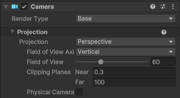

# Camera のお話

## Z-Fighting

FarClip と NearClip の範囲を広くしすぎる（例えばデフォルトの Near 0.3, Far 1000 とかにする）と、Depth 値の精度が足りず、カメラから遠いエリアでオブジェクトの重なりに不具合を生じることがある。これを Z-Fighting という。

上記はデフォルトで白と赤の Plane を 0.001 だけ離して置いた場合の Z-Fighting の様子。距離 400 程度から発生する。

これは Near と Far の差が大きいと発生し、精度的にはデフォルトだと 10 くらいの距離で精度の半分くらいを使ってしまい、それ以降は精度が荒くなる

## カメラの設定

### Projection

Perspective の場合、 Near と Far の差が大きくなりすぎないように、基本は Far を 100 くらいに設定する

### Renderring

ポストプロセスを使う場合は Post Processing をオンにする

往々にしてここがオフのままポストプロセスが反映されない！と悩むことがある

Render Shadows は UI の場合はオフにする

これによって描画コストを下げられる

Priority はカメラの描画順。同じだと順不同になるので必ず順番を決める

Culling Mask がカメラが描画する対象レイヤー

### Environment

Background Type は Skybox 以外の場合は Uninitialized にする

Solid Color にすると塗りつぶすことになり意外と負荷が高い

よほどの事情があって背景を単色で塗りつぶした上でそれを描画して見せたい場合以外は Uninitialized にして背景に相当する 3D オブジェクトを描画することで描画回数を節約できる

最後に、Post Processing がオンになっている場合、 Solid Color の Alpha は書き出せず 1.0 で fill されてしまうという Unity 上の仕様があるので注意!!

