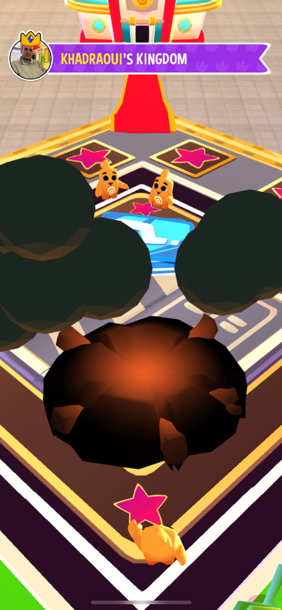
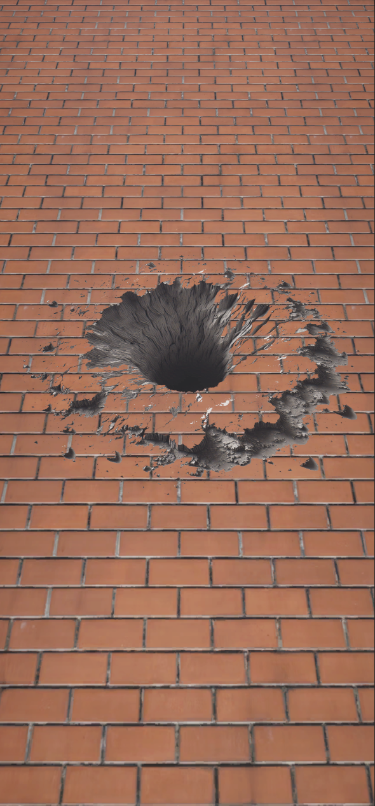
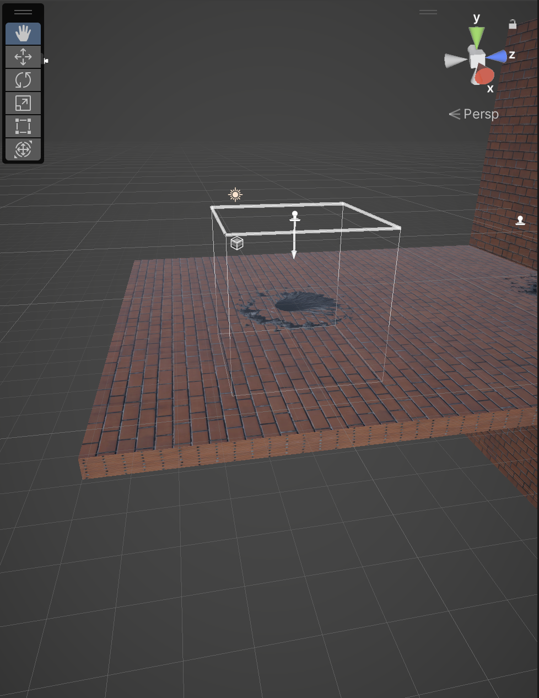

# デカール

## そもそもデカールとは？

デカール（Decal）とは、decalcomania（転写法、転写画）の略で、印刷・加工皇帝を終えあとは転写するだけの状態になったシートのことである

英語の decal には日本で一般的に、シール、ステッカー、マーキング、ペイントなどと呼ばれるものも広く含まれる

by Wikipedia

ということでシールのようなものである

## デカールを使うと何がよいのか？

シールのようにペタペタ貼るだけでテクスチャを使いまわせる上に2つのオブジェクトにまたがって表示したり画面の段差になっているような箇所に表示する際にポリゴン数の多いモデルを作ることなく実現できるという点にある

https://docs.unity3d.com/ja/Packages/com.unity.render-pipelines.universal@14.0/manual/renderer-feature-decal.html

## どういう場面で使われるか

道路の陥没や汚れを表現するために使われたりする

https://www.youtube.com/watch?v=1wHi9noDBSs&t=1818s

## 今回なぜデカールを取り上げたのか

Dice Dreams をやっていて、爆発跡があまりにも気持ち悪かったので自分で実装できないかと思って試した

## 試作品

sample-project を起動して DecalSample.unity を動かしてもらうのが手っ取り早いが、画像で説明すると、以下のように穴の表現に成功した

まずは Project Settings の Quality タブで設定しているレンダラー設定ファイルに設定を施す必要がある

https://docs.unity3d.com/ja/Packages/com.unity.render-pipelines.universal@14.0/manual/urp-renderer-feature-how-to-add.html

DecalSample.unity だと URP-HighFidelity-Renderer ファイルを参照していたので、 Settings 配下からそのファイルを選び、 Add Renderer Feature ボタンで Decal を追加すれば OK！

次に、素材作り。これはプロジェクトによってはだいたいアーティストさんが作ると思うので今回は品質は低いが簡単に作れる方法を紹介！

hatGPT に穴の画像をモノトーンで生成して！とお願いしてできた画像を [Normal Map を作る Web サイト](https://cpetry.github.io/NormalMap-Online/) を通じて Normal Map の画像データを生成する

マテリアルを Create > Material で新しく作成。シェーダーを ShaderGraphs/Decal に設定して上記で作った Base Map と Normal Map を貼り付ける

あとは [UnityにあるURP Decal Projector使ってみた](https://qiita.com/unnbabo/items/c02c93421a6c28129f4a) を参考に Herarchy から Create > Rendering > URP Decal Projector をクリックして作成。Width / Height / Projection Depth をいい感じに設定して、 Material に先程の Material を設定すると、 Scene View 上の Decal Projector で表示される直方体との交点にデカールが表示されるのでいい感じに配置すべし！

表示されない/うまくいかない場合は、レンダラー設定ファイルの設定忘れかオブジェクトが Decal Projector でないか、シェーダーが ShaderGraphs/Decal になってないとかだと思われる

ちなみに、斜めに表示したい場合は、回転して Decal Projector が2つのオブジェクトの中心あたりを向くようにすると正しく表示される

他にも設定など色々あるが、今はまだ試していない

ちなみに、 DecalSample.unity には Main Camera (1) と Main Camera (2) が非表示になっているが、 Main Camera (1) を表示すると斜め向きの例が表示できる

## デカール実装の課題

Main Camera (2) は床面に配置したデカールをカメラを反対方法に配置して撮影した様子である

このようにカメラが動くと破綻することがあるので、カメラを定点あるいは破綻のないことを確認してデカールを配置するか [YouTube 動画](https://www.youtube.com/watch?v=1wHi9noDBSs&t=1818s) の後半を見てもらうとわかるが、プログラムあるいは設定で破綻しないように表現してやると破綻を軽減できる

今回は Dice Dreams の爆発跡を改善したいという課題を解決するために取り組んだので、カメラは定点でよいのでこれにて解決としている
