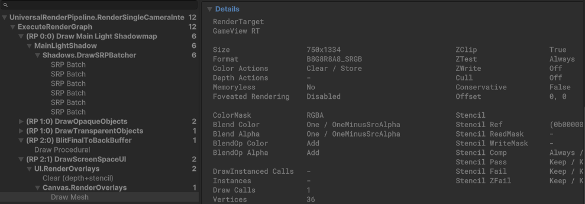

# ポストエフェクト

post processing effect といったり image effects と呼ぶ代物

リアルな絵をつくるために必須で、ディティールを凝るために必須

Unity にチュートリアルはあるのだが、 post processing-stack v2 というものの説明になっていて、 URP は標準で入っているので使わないようにする。なぜなら、post processing stack v2 は Built-in Render Pipeline 時代の古いポストシステムだから。 URP のポストプロセスと互換がない。 Unity Package Manager で Post Processing をインストールするような記事は post processing stack v2 の話なので、利用せず、下記の方法で利用する

URP 環境下では以下で利用可能

* Camera コンポーネントで Post Effect を有効にする
* Camera の Volume Mask を設定して Global Volume を認識できるようにする
* シーンに GameObject を置き、 Volume Mask で定義した Layer のいずれかを設定する
* GameObject に Volume コンポーネントを設定して、ポストエフェクトを追加する

## ポストプロセスは重い

なぜかというと画面全体に対して描画を行うため、ポストプロセスを複数かけると画面を描画するのと同じくらいの重さが何回も実行されるので重くなる

具体的には1回のエフェクトで百万〜のピクセル処理が走る

とはいえ、重いのと軽いのがある

### 重いの

* DoF(被写界深度)
* SSAO(詳細な影描画)
* Bloom(高輝度成分の色の滲み)
* Motion Blur(カメラ高速移動時の残像: 実はそんなに重くない)
* Panini Projection(高画角カメラの画面端の歪み矯正: 実はそんなに重くない)

### 軽いの

軽いと言うか、以下は Uber Postprocess 描画パスに一緒にまとめて描画してくれるので 1つ使うなら組み合わせて使っても重くはならない

* Channel Mixer
* Color Adjustments
* Color Curves
* Film Grain
* Lens Distotion
* Lift, Gamma, and Gain
* Shadows Midtones Highlights
* Split Toning
* Tonemapping
* White Balance

## HDR 描画について

ポストエフェクトの中にはシーンの描画結果のカラーバッファにおいて HDR 領域の色で描画されるピクセルを使うエフェクトがある

代表的なのは Bloom

ちなみに、 HDR とは High Dynamic Range の略で輝度が 1.0 よりも大きい色のこと
逆に LDR とは Low Dynamic Range のことで輝度が 0.0 〜 1.0 に収まるもの。すなわち RGB のこと

HDR 領域の色を活用するエフェクトを正しく描画するには HDR 描画が可能になるように設定する必要がある

ちなみに、 Unity はデフォルトは LDR 描画

HDR を有効にするには URP Asset の HDR 描画をオンにする

Render Texture に描画する場合は Color Buffer のフォーマット設定を Float 値のフォーマットに変更する必要がある( `R16G16B16A16_SFLOAT` もしくは `R32G32B32A32_SFLOAT` )

この設定は Render Texture 側のインスペクタで設定する

有効になっているかどうかを確認するには Frame Debugger を確認する

以下は FORMAT が SRGB なので LDR。ここが SFLOAT になっていれば HDR

ちなみに、上記は URPAsset の設定上は HDR が有効なのに LDR になっている

これはオブジェクトを配置しただけなので LDR 領域までしか輝度が上がらない

ライトを当てたり HDR テクスチャを貼るなどして輝度を HDR 領域まであげる必要がある

例えば、 Bloom で輝度を 1.0 より大きな値にするなどの必要がある

HDR 領域の色が必要なケースはだいたい Bloom くらい

ちなみに、カメラスタックを使って複数カメラに対して Bloom をかける場合、上のレイヤーは下のレイヤーのポストエフェクト描画後の描画結果を引き継ぐため、下のレイヤーでポストエフェクトかけて上のレイヤーでもポストエフェクトをかけると二重にポストエフェクトがかかってしまう

たとえば、3Dカメラに Bloom をかけた後、 UIカメラでも Bloom をかけると 3D 側のポストエフェクトが二重にかかる

そのため、カメラスタック利用時は特定のレイヤーに限定してポストエフェクトをかけるということができない（例えば、 UI レイヤーには Bloom をかけたいけど 3D レイヤー側には Bloom をかけたくないみたいな要望は満たせない）

Color Grading の設定にも注意が必要で URP Asset の設定によって使うエフェクトによっては以下の　Grading Mode を High Dynamic Range に変更する必要がある

これはカメラスタックを使う場合は注意!!

ちなみに、LDR を HDR に変える処理よりも Bloom を 1回かける方が圧倒的に重いと理解しておけば OK

話が前後するが、 Color Grading とは、ポストエフェクトを有効にすると固有で実行されるポストエフェクト

カラーバッファの色の範囲を LDR / HDR 領域に納める機能を持っている

Volume からは設定できず、 URP Asset の設定でどちらに丸めるかを指定する

これは Uber Postprocess 描画パスの冒頭で実行される

カメラスタック + HDR 描画を行っている場合は、 LDR 設定だと HDR 領域の色を次のカメラに引き継げないので HDR 設定にすべし

アンチエイリアスに関しては Unity 標準だと MSAA というポストエフェクトとは別の概念で Camera Component で設定するが、以下のアンチエイリアスはポストエフェクトとして実装されているので描画パイプラインの最後でエフェクトがかかる

* FXAA
* SMAA (MSAA とは違うよ)
* TAA

ちなみに、 MSAA は GPU 機能を使ってポストエフェクトパスとは違うタイミングで単独で動作するため非常に重いので、基本はオフにするべき（数FPS 落ちる可能性がある）

