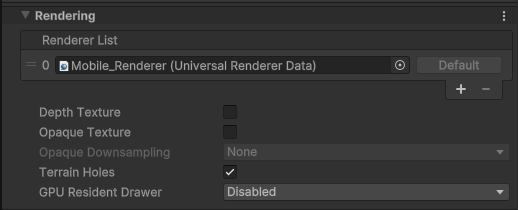
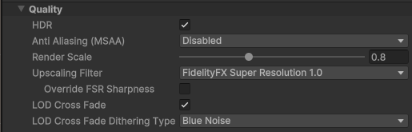
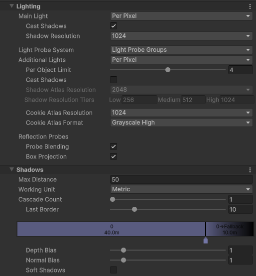
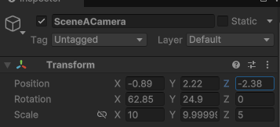

# URP の設定

テンプレートから選ぶと、 Mobile\_RP Asset (Universal Render Pipeline Asset) という名前で作成される

## Rendering

Depth Texture / Opaque Texture は基本オフに

基本描画コストが増える

## Quality

HDR はオフにすると Low Dynamic Range(LDR) になり、どんなに明るいライトを当てても輝度 1.0 以上の色を出力できないため、 Bloom などの高輝度成分を使ったポストエフェクトが機能しなくなる可能性があるため、基本オン推奨

Anti Aliasing(MSAA) は重いのでオフ推奨

## Lighting / Shadow

ライティングと影の大元の設定

基本デフォで OK

影がギザギザ/ガビガビになっている場合はここの設定を見直すとよい

## Post-processing

基本デフォで OK

# URP Asset を複数作る必要があるか？

基本小さなゲームでは 1つで OK

URP Asset を使い分ける事例としては Project Settings の Quality の項目において高クオリティ・高負荷、中クオリティ・中負荷、低クオリティ・低負荷にわけたものを用意して切り替える感じ

ちなみに、 Project Settings で URP Asset を設定する項目として、 Graphics と Quality があるが、同時に使われるのは 1つだけで、 Quality の方が優先して使われる

つまり Grapchis の方が Fallback 用と考えておくと良い

ちなみに、 Quality において PC と Android / iOS で採用される URP Asset が違うとビルドの見え方が違ってみえるので要注意

