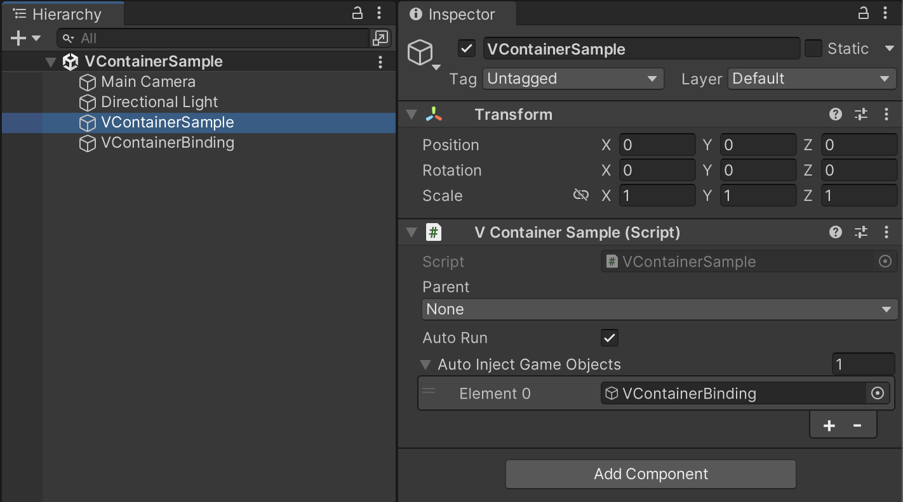

# VContainer (v1.15.4)

仕組みはなんとなくわかってるのでどちらかというと、コードリーディングのために記述する

## VContainer.Unity.LifetimeScope (358行)

### 最初に実行される理由

```cs
namespace VContainer.Unity
{
    // DefaultExecutionOrder 属性
    // スクリプトの順序を保証するための Attribute
    // マイナスなほど最初に実行される
    // Unity シーン上の MonoBehaviour の中でなるべく最初に実行してほしい
    // という意図であることがわかる
    [DefaultExecutionOrder(-5000)]
    public partial class LifetimeScope : MonoBehaviour, IDisposable
```

### Awake で処理される内容

```cs
        protected virtual void Awake()
        {
            // 診断が有効もしくは scopeName が空なら独自の scopeName をつける
            // LifetimeScope を継承するオブジェクトが複数ある場合にどんな情報を持ってるか
            // を把握するために役立つのかな？
            if (VContainerSettings.DiagnosticsEnabled && string.IsNullOrEmpty(scopeName))
            {
                scopeName = $"{name} ({gameObject.GetInstanceID()})";
            }
            try
            {
                // 親を格納する
                Parent = GetRuntimeParent();
```

一旦コメントアウトはここまでにして GetRuntimeParent() を見ていく

```cs
        LifetimeScope GetRuntimeParent()
        {
            // 内部実装は
            // VContainerSettings.Instance != null &&
            // VContainerSettings.Instance.IsRootLifetimeScopeInstance(this)            // すなわち、VContainerSettings.Instance がある場合かつ VContainerSettings.Instance 経由で
            // このオブジェクトが RootLifetimeScope であるとなった場合 null が返る
            // のだが、 VContainerSettings.Instance は UnityEditor 上で
            // かつ VContainerSettings.asset が Resources フォルダに配置されない限り
            // true にならない仕組みになっている
            if (IsRoot) return null;
```

VContainerSettings の該当の箇所は以下

```cs
if UNITY_EDITOR

// ...(略)...

        public static void LoadInstanceFromPreloadAssets()
        {
            var preloadAsset = UnityEditor.PlayerSettings.GetPreloadedAssets().FirstOrDefault(x => x is VContainerSettings);
            if (preloadAsset is VContainerSettings instance)
            {
                instance.OnDisable();
                instance.OnEnable();
            }
        }

        [RuntimeInitializeOnLoadMethod(RuntimeInitializeLoadType.BeforeSceneLoad)]
        static void RuntimeInitialize()
        {
            // For editor, we need to load the Preload asset manually.
            LoadInstanceFromPreloadAssets();
        }
#endif

// ...(中略)...

        void OnEnable()
        {
            if (Application.isPlaying)
            {
                Instance = this;
```

GetRuntimeParent() の処理に戻る

```cs
        LifetimeScope GetRuntimeParent()
        {
            // 上記より UnityEditor でかつ VContainerSettings が Resources フォルダ配下で
            // ロードできた場合以外は false なので通らない
            if (IsRoot) return null;

            // parentReference.Object は Unity ライフサイクル上は Awake 時には null にしかなり得ないので通らない
            if (parentReference.Object != null)
                return parentReference.Object;

            // 上記の通り、 Type は null なのでここも通らない
            if (parentReference.Type != null && parentReference.Type != GetType())
            {
                var found = Find(parentReference.Type);
                if (found != null && found.Container != null)
                {
                    return found;
                }
                throw new VContainerParentTypeReferenceNotFound(
                    parentReference.Type,
                    $"{name} could not found parent reference of type : {parentReference.Type}");
            }

            // ここも通らない
            lock (SyncRoot)
            {
                if (GlobalOverrideParents.Count > 0)
                {
                    return GlobalOverrideParents.Peek();
                }
            }

            // ここも通らない
            if (VContainerSettings.Instance != null)
            {
                return VContainerSettings.Instance.GetOrCreateRootLifetimeScopeInstance();
            }

            return null;
        }
```

つまり、 null が返り、 Parent = null となる
Awake() の処理に戻る

```cs
        protected virtual void Awake()
        {
            // ...(略)...
            try
            {
                Parent = GetRuntimeParent();
                // autoRun は SerializeField なプロパティ
                // 基本 true の状態で実行される
                if (autoRun)
                {
                    Build();
                }
            }
```

Build() の処理を見る

```cs
        public void Build()
        {
            // もう一度通るが、 結果 Parent == null になる
            if (Parent == null)
                Parent = GetRuntimeParent();

            // なのでこちらは通らない
            if (Parent != null)
            {
                if (VContainerSettings.Instance != null && Parent.IsRoot)
                {
                    if (Parent.Container == null)
                        Parent.Build();
                }

                // ReSharper disable once PossibleNullReferenceException
                Parent.Container.CreateScope(builder =>
                {
                    builder.RegisterBuildCallback(SetContainer);
                    builder.ApplicationOrigin = this;
                    builder.Diagnostics = VContainerSettings.DiagnosticsEnabled ? DiagnositcsContext.GetCollector(scopeName) : null;
                    InstallTo(builder);
                });
            }
            else
            {
                // IContainerBuilder の総本山
                // ここでは主にここを起点に依存関係を解消するためにインスタンスを生成している
                var builder = new ContainerBuilder
                {
                    ApplicationOrigin = this,
                    Diagnostics = VContainerSettings.DiagnosticsEnabled ? DiagnositcsContext.GetCollector(scopeName) : null,
                };
                // 文字通り Build() メソッド実行後の Callback
                // 実行の最後に SerializeField に設定した autoInjectGameObjects を Container で扱えるようにしている
                builder.RegisterBuildCallback(SetContainer);
                InstallTo(builder);
                builder.Build();
            }

            AwakeWaitingChildren(this);
        }

        // ...(略)...

        void AutoInjectAll()
        {
            if (autoInjectGameObjects == null)
                return;

            foreach (var target in autoInjectGameObjects)
            {
                if (target != null) // Check missing reference
                {
                    Container.InjectGameObject(target);
                }
            }
        }
```

InstallTo() について導入だけ触れる
以下のようにここで Configure(builder) が実行されているため、LifetimeScope を継承した MonoBehaviour で Configure を override するとここで実行される

```cs
        void InstallTo(IContainerBuilder builder)
        {
            Configure(builder);
```

## Dependency Injection の仕組み

VContainer では、 Register メソッドを使ってインスタンス生成方法を VContainer に登録して、 [Inject] 属性を付与したフィールドやコンストラクタ、メソッドに VContainer が自動的にインスタンスを注入する。VContainer は、登録された情報に基づいて、適切なインスタンスを生成し、依存関係を解決する

```cs
// 依存関係を持つクラス
public class MyClass
{
    [Inject]
    public IMyDependency Dependency { get; set; }

    public MyClass(IMyDependency dependency)
    {
        this.Dependency = dependency;
    }

    public void MyMethod([Inject] IMyDependency dependency)
    {
        // ...
    }
}

// 依存関係の登録
var builder = new ContainerBuilder();
builder.Register<MyDependency>(Lifetime.Transient);
builder.Register<MyClass>(Lifetime.Scoped);

// インスタンスの取得
var container = builder.Build();
var myClass = container.Resolve<MyClass>();
```

ちなみに、 buiklder.Build() の処理は LifetimeScope.cs の Awake() で実行しているので、 Configure の後実行されると考えてもらって問題ない

[Inject] 属性をつけなくても自動で注入してくれたり、 Resolve しなくても自動で解決してくれるのも VContainer の役目だが、具体的にしっくりきていないのでここは実装して確認することにする

## sample-project

上記の Inject している様子は sample-project から確認されたい

一応一部状況が確認できるようにリンクを残しておく



[VContainerSample](unity/sample-project/Assets/Scripts/VContainerSample/VContainerSample.cs)
[VContainerBinding](unity/sample-project/Assets/Scripts/VContainerSample/VContainerBinding.cs)
